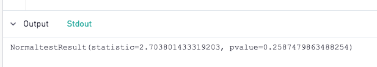

# Test for Normal Distribution of Data with Python

One of the first steps in exploratory data analysis is to identify the characteristics of the data, importantly including a test for distribution patterns. In this example, learn how to check if your data is normally distributed in Python with a visualization as well as a calculation given by the Scipy library.

In this example, we'll work with the Human Body Temperatures dataset, [available here](https://github.com/PeriscopeData/analytics-toolbox/tree/master/Datasets/Human%20Body%20Temperatures). Start by loading the CSV to your site ([instructions here](https://doc.periscopedata.com/article/csv-upload#article-title)). In this example, we'll construct an Empirical cumulative distribution function ([ECDF](https://en.wikipedia.org/wiki/Empirical_distribution_function)) to visualize the distribution of the data.

Most of the work will be done in Python, so for the SQL code, simply use the following:

`select * from [human_body_temperature]`

In Python 3.6, start by importing packages:

```
import pandas as pd
import numpy as np
import matplotlib.pyplot as plt
import seaborn as sns
from scipy import stats
```

Pandas will be used to handle the dataframe; numpy will be used to calculate a few key statistics such as median and standard deviation as well as to draw random samples from the dataset, matplotlib.pyplot and seaborn will be used together to generate the plot, and scipy will be used for the mathematical calculation of the normal statistics.

Next, let's define a function that will generate plottable points:

```
def ecdf(data):
    """Compute ECDF for a one-dimensional array of measurements."""

    # Number of data points: n
    n = len(data)

    # x-data for the ECDF: x
    x = np.sort(data)

    # y-data for the ECDF: y
    y = np.arange(1, n+1) / n

    return x, y
```

This function takes a list of sample readings (temperatures in this example) and sorts them from lowest to highest. It returns a set of (x,y) pairs that represent the temperature reading and the relative position in the sorted list, or percentile, of each reading.

Next, we'll run that function on our sample data to get plottable datapoints.

`x, y = ecdf(df["temperature"])`

We can then use matplotlib and seaborn to plot our sample data with the following code:

```
plt.figure(figsize=(8,7))
sns.set()
plt.plot(x, y, marker=".", linestyle="none")
plt.xlabel("Body Temperature (F)")
plt.ylabel("Cumulative Distribution Function")
```

Running this will yield a chart that looks like the following:
 

 

 
Excellent! We can really start to see the curve here. Now, in order to compare this to a perfect normal distribution, we'll need to plot a second series of data. This could be done in a number of ways, but in this tutorial, we'll use a technique called [bootstrapping](https://en.wikipedia.org/wiki/Bootstrapping_(statistics)) to accomplish the task.

The following code will generate 10,000 'temperatures' that follow a normal distribution using the mean and the standard deviation of our dataset to scale the range.

`samples = np.random.normal(np.mean(df["temperature"]), np.std(df["temperature"]), size=10000)`

This data will just be a list of temperatures. We can transform this randomized data into x,y pairs using the same function we defined earlier, allowing us to plot the data alongside the actual samples with the following code:

`x_theor, y_theor = ecdf(samples)`

These theoretical examples represent how the data would look if we had 10,000 samples and the distribution of the readings were perfectly normal. It's a hypothetical we can use to compare reality.

Let's plot this on the same chart as our earlier data with the following code and add a legend:

```
plt.plot(x_theor, y_theor)
plt.legend(('Normal Distribution', 'Empirical Data'), loc='lower right')
```

And of course, don't forget the output function:

`periscope.output(plt)`

We should get a chart like this:

 

Check that out! It looks like our sample data (blue) is very close to the true normal distribution! We can probably consider this data normally distributed. 

Let's add one more line of code to provide further insight into the distribution:

`print(stats.normaltest(df["temperature"]))`

Anything printed can be seen in the Stdout tab:

 

This will run [SciPy's normal test](https://docs.scipy.org/doc/scipy/reference/generated/scipy.stats.normaltest.html) and print the results including a p representing A [2-sided chi squared probability](https://en.wikipedia.org/wiki/Pearson%27s_chi-squared_test) for the hypothesis test. If the p value is less than our alpha (significance value), we can reject the hypothesis that this sample data is normally distributed. If greater, we cannot reject the null hypothesis and must conclude the data is normally distributed. 

Give it a try! Based on this examination of 130 samples, can we conclude that human body temperature is normally distributed?