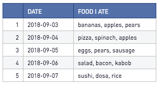
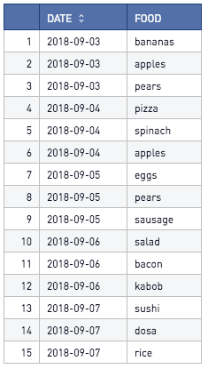

# Unnest, Disaggregate Array-Like Data

Let’s say you have some aggregated data and want to break it out into multiple rows. Maybe the original data source provided the values in this format, or maybe it was produced by another SQL View using Listagg() or Stringagg(). Perhaps it's extracted from a JSON array. In any case, the data looks something like this:

 


How can we undo it? Or how can we produce the following chart with a new row for each item?

 

 

To do this, we’ll need to use the power of the cross join, a numbers table, and a clever use of the split_part() function. To follow along, generate a “food” table with the following SQL:

```
with food as (
select '2018-09-03' as date, 'bananas, apples, pears' as food_i_ate
union all
select '2018-09-04', 'pizza, spinach, apples'
union all
select '2018-09-05', 'eggs, pears, sausage'
union all
select '2018-09-06', 'salad, bacon, kabob'
union all
select '2018-09-07', 'sushi, dosa, rice'
)
select * from food
```

Now let’s make sure we have a numbers table. In this example, we only have 3 items per row (ex: pizza, spinach, and apples). It’s important that the numbers table has values ranging from 1 to the highest number of entries in the aggregated column. So for this example, we need at least 1 through 3. The table generated below goes way higher, and that's fine. We’ll use [this guide](https://www.periscopedata.com/blog/generate-series-in-redshift-and-mysql) to generate our numbers table.

```
with numbers as (
  select
  row_number() over()::int as part_number
from
  users
)
Select * from numbers
```

*Note: This example uses my "users" table. In your case, choose a table with at least as many rows as the cell with the most items has items.

Now that we have our data and our numbers table ready, let’s execute the cross-join. A cross join will produce a new row for every unique combination of rows in the left and right tables. So if we have 5 rows in the food table and 10 rows in our numbers table, the result of the cross join will have 50 rows. This will give us a large table that might not make sense just yet, but bear with me!

```
with food as (
select '2018-09-03' as date, 'bananas, apples, pears' as food_i_ate
union all
select '2018-09-04', 'pizza, spinach, apples'
union all
select '2018-09-05', 'eggs, pears, sausage'
union all
select '2018-09-06', 'salad, bacon, kabob'
union all
select '2018-09-07', 'sushi, dosa, rice'
)
, numbers as (
  select
  row_number() over()::int as part_number
from
  users
)
select
  date
  , food_i_ate
  , part_number
from
  food
  cross join numbers
order by 1, 3
```


And the output looks like this: 
 


We’re almost there! It’s time to use these columns along with the split_part() function to get one item at a time. The function definition and documentation is provided below. We’ll use the aggregated column as the first argument, the delimiter (a comma) as the second argument, and part_number as the third argument. It should be clear now why we named the numbers column as part_number!

Let’s change the outer query to the following:

```
select
  date
  , food_i_ate
  , part_number
  , split_part(food_i_ate, ',', part_number)
from
  food
  cross join numbers
order by 1, 3
```

That gives us a result that looks like this:

 
From here, we’re just doing cleanup! We only care about two of the columns, and we don’t want nulls or empty strings in our results. To reflect that, change the outermost query to the following:

```
select
  date
  , split_part(food_i_ate, ',', part_number) as food
from
  food
  cross join numbers
where
split_part(food_i_ate, ', ', part_number) is not null
and split_part(food_i_ate, ', ', part_number) <> ' '
order by 1
```

And voila! It takes a few steps, but it's not impossible. Aggregate responsibly! 

The final code from this exercise is included in the SQL file.