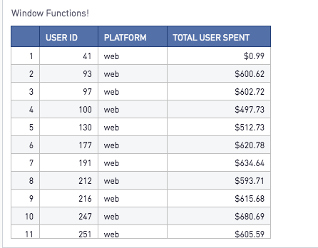
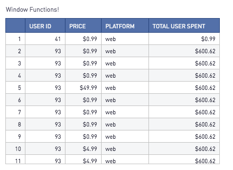

# Window Functions!

Window Functions are a great way to analyze your data in a different way! Similar to other calculation statements in SQL, window functions allow you to do a calculation across a set of rows or columns. The difference is with window functions the data will not be grouped into a single output row and will return a value for every row in that window. The values returned are calculated by utilizing the values from the sets of rows in that window. The window defines, for each row in the table, as set of rows that is used to compute additional attributes. A window is defined using a window specification (the OVER clause), and is based on three main concepts:

Window Partitioning, which forms groups of rows (PARTITION clause)
Window Ordering, which defines an order or sequence of rows within each partition (ORDER BY clause)
Window Frames, which are defined relative to each row to further restrict the set of rows (ROWS specification)
There are two types of functions aggregation (AVG, COUNT, SUM, etc.) and ranking functions (Rank, Row_number, etc.) that can be used in window functions.

### 1. When do I use a Window Function?

There are many useful cases. Window functions can be leveraged so summarize information at a different level. For example, the below query without a window function will group the amount column by user_id and platform and give use summarized results.

```SQL
Select
   user_id
 , platform
 , [Sum(price):$] total_user_spent
From
 Purchases

Group By 
     user_id
   , platform
```
This would give you the following results:



If you wanted to see the individual rows of user ids, platform and price but also see the total spend by users you could use a window function! The query below will give you the detailed results of the User Id, individual price, platform and the total spend by user.

```SQL
Select
   user_id
 , [price:$] Price
 , platform
 , [Sum(price) Over(Partition By user_id):$] As total_user_spent
From
 Purchases
```

This would give you the following results:



### 2. How do I set up a Window Function?

The basic structure of a window function is:

```SQL
Select
  < Window_Function > Over(Partition By < Field >) As < Field_Name >
From
  < Table >  
```  

### 3. What functions are used in Window Functions?

The functions below can be used in window functions. Note that the available functions and syntax maybe different between databases. Window functions are available in PostgreSQL, SQL Server, Redshift, and Oracle (and calls them "Analytic Functions" ).

> - ### AVG
> - ### COUNT
> - ### CUME_DIST
> - ### DENSE_RANK
> - ### FIRST_VALUE
> - ### LAG
> - ### LAST_VALUE
> - ### LEAD
> - ### MAX
> - ### MEDIAN
> - ### MIN
> - ### NTH_VALUE
> - ### NTILE
> - ### PERCENTILE_CONT
> - ### PERCENTILE_DISC
> - ### PERCENT_RANK
> - ### RANK
> - ### RATIO_TO_REPORT
> - ### ROW_NUMBER
> - ### STDDEV_POP
> - ### STDDEV_SAMP
> - ### SUM
> - ### VAR_POP
> - ### VAR_SAMP

And some more!

More examples on using the window functions check out [this](https://www.periscopedata.com/blog/window-functions-by-example) amazing blog post.

Using window functions with date series check out [this](https://www.periscopedata.com/blog/generate-series-in-redshift-and-mysql) great blog post.